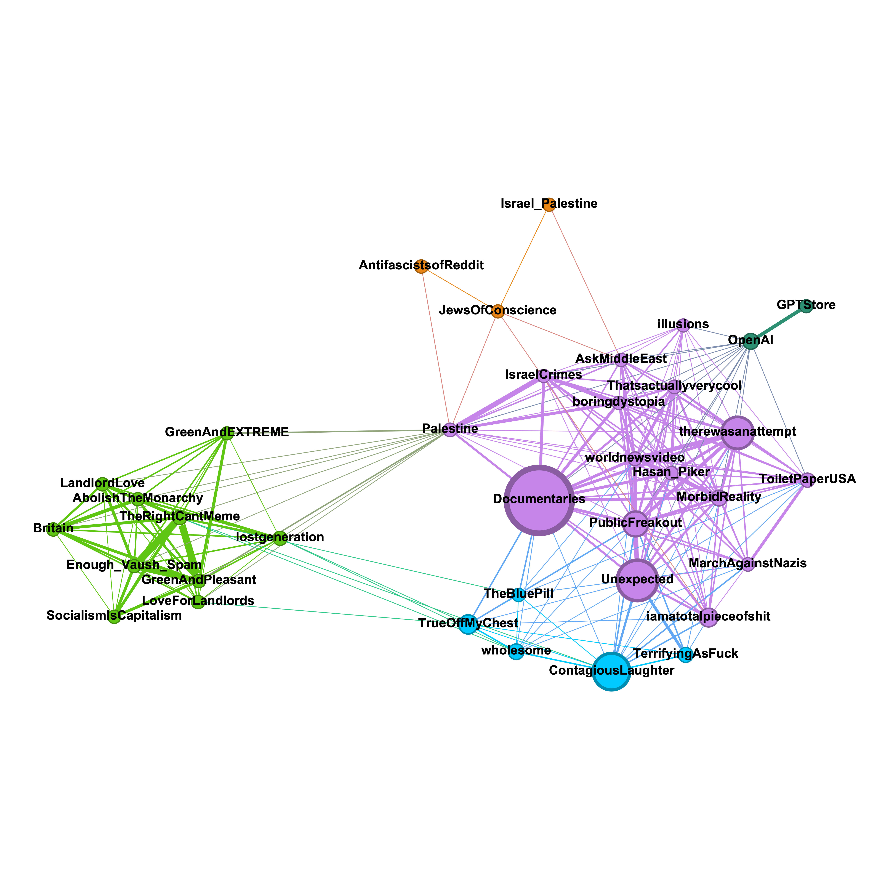
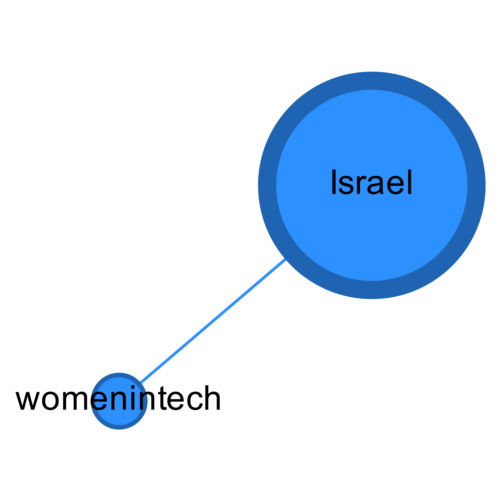

## Analysing mod team overlap: r/Palestine and r/Israel

Notes:
* Only subreddits with >5K members are visualised.
* The edge width is proportional to the number of moderators in common.
* The node diameter is related to the number of members in a sub.
* The colour is based on cluster detection using the Louvain method (in-built in Gephi)
* I only searched two levels deep.
* The graph related to r/Palestine has been truncated, because a two-level-deep search already yielded 1265 subreddits. I only kept nodes having a degree >5. The graph related to r/Israel was kept in full. 
* Known and inferred bots have been removed.

Tools used: Python and PRAW library for data collection, Pandas for data analysis, Gephi for visualisation.
Source: Data collected myself on 03 Feb 2024.

### r/Palestine

### r/Israel

