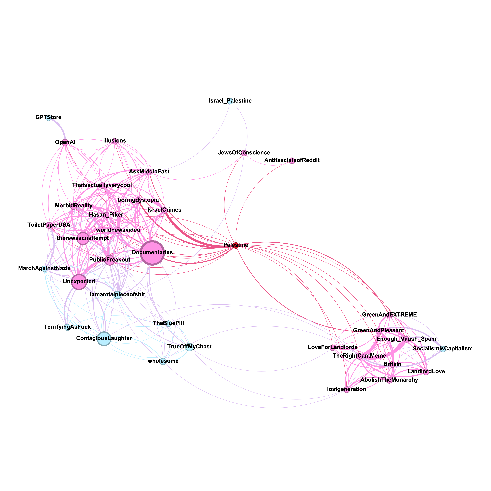

## Analysing mod team overlap: r/Palestine and r/Israel

Notes:
* Each edge is between a pair of subs that have a mod in common.
* The more mods there are in common, the thicker the edge.
* The more members there are in a sub, the bigger the circle.
* Only subs with >5K members are visualised.
* The color is based on the degree of removal. E.g. in the first chart, the subs that share a mod with r/Palestine are colored pink, whereas the subs that share a mod with a pink sub are colored blue.
* All inferred and suspected bots were removed prior to analysis.
* The graph related to r/Palestine has been truncated, because a two-level-deep search already yielded 1265 subreddits. I only kept nodes having a degree >5. The graph related to r/Israel was kept in full. 

Tools used: Python and PRAW library for data collection, Pandas for data analysis, Gephi for visualisation.
Source: Data collected myself on 03 Feb 2024.

### r/Palestine

### r/Israel

